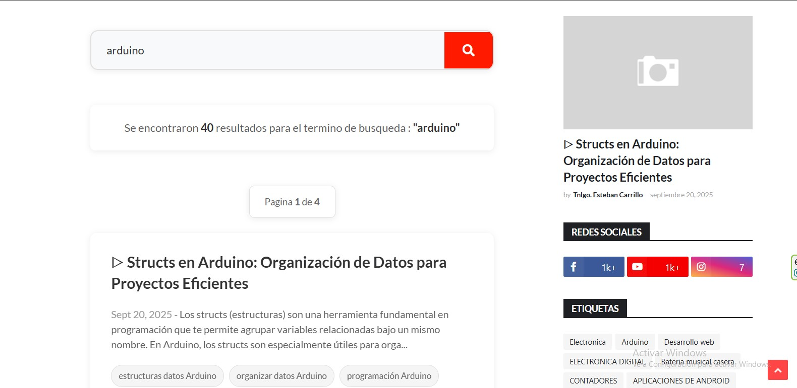
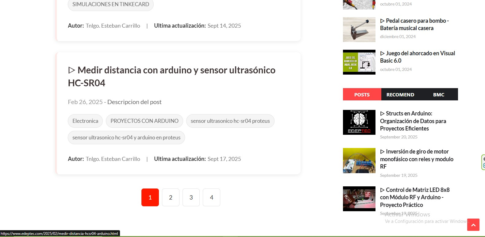

Motor de búsqueda para blogs de Blogger
=====================================

Previsualizacion:
-----------------





Descripción:
------------

Este buscador se utiliza para encontrar publicaciones de nuestro blog de Blogger, relacionadas con el término de búsqueda introducido. Podemos utilizarlo dentro del blog de Blogger o en una página web externa.

Tecnologías utilizada:
----------------------

*   HTML
*   CSS
*   JavaScript - jQuery
*   Webpack

Requisitos:
----------------------
*   Tener el cdn de jQuery cargado en tu blog de blogger.

Como usarlo:
------------

1.  Crea una nueva página en tu blog de blogger. 

2.  Pega los siguientes códigos en tu pagina de blogger.
* Codigo CSS:
Código obtenido del archivo [./src/style.min.css](./src/style.min.css).
```html
<style type = "text/css">
.loading,.posts-search-info,.search-logo{text-align:center!important}ul li,ul#pagination{list-style:none!important}.page-number,.post-content__info,.post-content__url{text-decoration:none!important}:root{--negro:#393939;--tipo-principal:"Segoe UI",Tahoma,Geneva,Verdana,sans-serif;--tipo-secundaria:Verdana;--max-width-container:73.125rem;--width-container:95%;--color-primario:#313234;--color-titulos:#313234;--color-secundario:#ff1a00;--color-terciario:#999999;--color-white:white;--color-de-fondo:white;--color-texto-p:#5e5e5e;--bg-navChildren:#fb4834b0;--color-borde:#e0e0e0;--color-fondo-input:#f8f9fa;--sombra-suave:0 2px 10px rgba(0, 0, 0, 0.08);--sombra-enfocado:0 4px 15px rgba(0, 0, 0, 0.12);--radio-borde:12px;--transicion-rapida:all 0.3s ease}.search-logo,body{color:var(--color-primario)}*{margin:0;padding:0;box-sizing:border-box;word-wrap:break-word}body{font-family:var(--tipo-principal)!important;background-color:#f5f7fa;line-height:1.6}.posts-search-container{padding:3rem 0 5rem!important;gap:2rem!important;flex-direction:column!important;align-items:center!important;justify-content:flex-start!important;min-height:100vh!important;display:flex!important}.container{max-width:90%!important;margin:0 auto!important;width:100%}.search-logo{margin-bottom:2rem!important;width:100%!important;height:max-content;font-size:2.5rem!important}.search-logo img{width:280px!important;max-width:100%!important;height:auto;transition:transform .5s}.search-logo img:hover{transform:scale(1.03)}.search-input-container{display:flex!important;align-items:center!important;gap:0!important;justify-content:space-between!important;border:2px solid var(--color-borde)!important;border-radius:var(--radio-borde)!important;transition:var(--transicion-rapida)!important;margin-bottom:1.5rem!important;min-width:50%!important;max-width:700px!important;width:100%;padding:0!important;background:var(--color-fondo-input);box-shadow:var(--sombra-suave);overflow:hidden}#postPageSearchBtn,.page-number,.post-content__url p,.post-searched__content,.tag-text{transition:var(--transicion-rapida)}.search-input-container:focus-within{border-color:var(--color-secundario)!important;box-shadow:var(--sombra-enfocado)!important}.search-input-container input{font-size:1.1rem!important;font-family:inherit!important;background-color:transparent!important;border:none!important;color:var(--color-primario)!important;width:100%!important;padding:1.2rem 1.5rem!important;outline:0!important}.pagination-container-info p,.post-searched__content,.posts-search-info{background:#fff;box-shadow:var(--sombra-suave)}.post-content__ad b,.posts-search-info b,.tag-text:hover{color:var(--color-primario)}.search-input-container input::placeholder{color:#a0a0a0}#postPageSearchBtn{cursor:pointer!important;padding:1.2rem 1.8rem!important;background:var(--color-secundario);color:#fff;border:none;display:flex;align-items:center;justify-content:center;font-size:1.2rem}#postPageSearchBtn:hover{background:#e01600}.search-results-container{width:100%!important;max-width:900px;margin:0 auto}.loading{font-size:1.5rem!important;color:var(--color-terciario);padding:2rem}.posts-search-info{padding:1.5rem 2rem!important;font-size:1.1rem;color:var(--color-texto-p);border-radius:8px;max-width:700px;width:100%;margin:0 auto 1.5rem}.posts-results-container{display:flex!important;flex-direction:column!important;gap:1.8rem!important;margin-bottom:2rem}.post-searched__content{display:grid!important;gap:.8rem!important;border-radius:10px;padding:1.8rem!important;border-left:4px solid transparent;animation:.5s forwards fadeIn}.post-searched__content:hover{transform:translateY(-3px);box-shadow:0 5px 15px rgba(0,0,0,.1);border-left-color:var(--color-secundario)}.post-content__url{color:var(--color-titulos)!important}.post-content__url p{font-weight:700!important;font-size:1.5rem!important;line-height:1.4!important;margin-bottom:.5rem!important}.post-content__url:hover p{color:var(--color-secundario)!important}.post-content__info{padding-left:0!important;color:var(--color-texto-p);font-size:1rem}.post-date{color:var(--color-terciario)!important;font-weight:500}.post-content-tags{display:flex!important;gap:.5rem!important;flex-wrap:wrap!important;margin-top:.5rem}.tag-text{border:1px solid #e0e0e0!important;padding:.3rem .7rem!important;border-radius:20px;font-size:.85rem;color:#666;background:#f5f5f5}.tag-text:hover{background:#eaeaea}.post-content__ad{display:flex;gap:1rem;flex-wrap:wrap;margin-top:.8rem;font-size:.9rem;color:#777}.post-content__ad span{display:flex;align-items:center;gap:.3rem}.pagination-container{display:flex!important;justify-content:center!important;margin-top:2rem}.pagination-container-info{display:flex!important;justify-content:center!important;margin-bottom:1.5rem}.pagination-container-info p{border:1px solid var(--color-borde)!important;padding:.8rem 1.5rem!important;margin-bottom:0!important;border-radius:8px;font-size:.95rem}ul#pagination{display:flex!important;gap:.5rem!important;flex-wrap:wrap!important;margin-top:0!important;justify-content:center!important;align-items:center!important}ul#pagination li:before{content:""!important}.page-number{color:var(--color-primario)!important;background-color:#fff!important;padding:.7rem 1.1rem!important;border-radius:6px;border:1px solid var(--color-borde);font-weight:500;display:block}.page-number:hover{background-color:#f0f0f0!important;transform:translateY(-2px)}.page-li-focus{background:var(--color-secundario)!important;color:#fff!important;border-color:var(--color-secundario)!important}.no-results{text-align:center;padding:3rem;color:var(--color-terciario);font-size:1.2rem}.no-results i{font-size:3rem;margin-bottom:1rem;color:#ddd}@media screen and (max-width:768px){.posts-search-container{padding:2rem 0 3rem!important}.search-logo{font-size:2rem!important;margin-bottom:1.5rem!important}.search-logo img{width:200px!important}.search-input-container{max-width:95%!important;flex-direction:row}.search-input-container input{font-size:1rem!important;padding:1rem 1.2rem!important}#postPageSearchBtn{padding:1rem 1.5rem!important}.post-searched__content{padding:1.5rem!important}.post-content__url p{font-size:1.3rem!important}.post-content__ad{flex-direction:column;gap:.5rem}ul#pagination{gap:.3rem}.page-number{padding:.6rem .9rem!important;font-size:.9rem}}@media screen and (min-width:768px) and (max-width:1024px){.search-logo img{width:240px!important}.search-input-container{max-width:85%!important}}@keyframes fadeIn{from{opacity:0;transform:translateY(10px)}to{opacity:1;transform:translateY(0)}}.search-input-container{animation:.7s fadeIn}
</style>
```
* Código HTML:
Código obtenido del archivo [./src/index.html](./src/index.html).
```html
<div id="searchEngineRoot" class="posts-search-container container"></div>
```
* Código JavaScript:
Código obtenido del archivo [./dist/index.js](./dist/index.js).
```html
<script type = "text/javascript">
(()=>{"use strict";const t={blogUrl:"",textOrImgUrl:"Nombre o logo de tu blog",resultsPerPage:10,monthFormat:["","Ene","Feb","Mar","Abr","May","Jun","Jul","Ago","Sept","Oct","Nov","Dic"]},e=function(e,n){const s=$(".posts-results-container");s.html(""),e=e.slice((n-1)*t.resultsPerPage,n*t.resultsPerPage),s.append(e.map((e=>(e=>{const n=document.createElement("div");n.classList.add("post-searched__content");let s="",a="",o=$("<div>").html(e.content.$t);a=o.find("p.blog-post-description").text()?o.find("p.blog-post-description").text():"Descripcion del post";for(let t=0;t<e.link.length;t++)if("alternate"==e.link[t].rel){s=e.link[t].href;break}let r=e.published.$t,i=r.substring(0,4),l=r.substring(5,7),c=r.substring(8,10),p=t.monthFormat[parseInt(l,10)]+" "+c+", "+i,u=e.updated.$t,d=u.substring(0,4),g=u.substring(5,7),h=u.substring(8,10),m=t.monthFormat[parseInt(g,10)]+" "+h+", "+d;const b=`\n    <a target ="_blank" class = "post-content__url" href = "${s}"><p>${e.title.$t}</p></a>\n      <p class="post-content__info">\n                <span class ="post-date" >${p}</span> - ${a.slice(0,200)}${a.length>200?"...":""} \n              </p>\n              <p class="post-content-tags">${void 0!==e.category?e.category.map((t=>`<span class= "tag-text">${t.term}</span>`)).join(""):'<span class= "tag-text">No tags found</span>'}</p>\n              <p class="post-content__ad">\n                  <span><b>Autor:</b> ${e.author[0].name.$t}</span> |\n                  <span><b>Ultima actualización:</b> ${m}</span>\n            </p>`;return n.innerHTML=b,n})(e))))},n=async function(n){const s=$("#searchResultsContainer");let a=$(".posts-search-info"),o=$("#logo");if(a.html("Cargando..."),s.empty(),""===n)return a.html("Error, Ingrese un termino de busqueda.");if(!function(t){let e=new RegExp(/^[A-Za-z0-9\s]+$/g);return t.trim(),t.match(e)}(n))return a.html("Error, No se admiten caracteres especiales como terminos de busqueda.");const r=new URL(window.location.href);r.searchParams.set("search",n),window.history.pushState({},"",r.href),o.animate({height:0},300),setTimeout((()=>{o.hide()}),500);try{const o=await function(e){const n=`${t.blogUrl}/feeds/posts/default/?alt=json-in-script&q=${e}&max-results=500`;return $.ajax({url:n,type:"get",dataType:"jsonp",success:function(t){return t},error:function(t,e,n){return n}})}(n),{entry:r}=o.feed;if(void 0===r)return a.html(`No Se encontaron resultados para el termino de busqueda : <b>"${n}"</b>`);a.html(`Se encontraron <b>${r.length}</b> resultados para el termino de busqueda : <b>"${n}"</b>`),s.html(' \n        <p class="pagination-container-info"></p>\n        <div class="posts-results-container"></div>\n        <div class="pagination-container"><ul id="pagination"></ul></div>');const i=function(e){const n=$("#pagination"),s=e,a=Math.ceil(s/t.resultsPerPage);n.html("");for(let t=1;t<=a;t++)n.append('<li ><a href = "#" class = "page-number">'+t+"</a></li>");return $(".page-number").first().addClass("page-li-focus"),a}(r.length);let l=$(".pagination-container-info");const c=t=>{l.html(`<p>Pagina <b>${t}</b> de <b>${i}</b></p>`)};let p=1;$(".page-number").each(((t,n)=>{$(n).on("click",(function(){c(t+1),$(".page-number").removeClass("page-li-focus"),$(n).addClass("page-li-focus"),e(r,t+1)}))})),c(p),e(r,1)}catch(t){console.log("Ha ocurrido un error al obtener los datos.")}};jQuery((function(){$("#searchEngineRoot").html('<div class="search-logo" id="logo"></div>\n      <div class="search-input-container">\n        <input\n          type="text"\n          name=""\n          id="searchInput"\n          placeholder="Ingrese el termino de busqueda."\n        /><span id="postPageSearchBtn" class="fas fa-search"></span>\n      </div>\n      <p class="posts-search-info"></p>\n      <div class="search-results-container" id="searchResultsContainer"></div>');let e=$(".posts-search-info");$("#logo").append(t.textOrImgUrl.match("^https?://")?``:`<p>${t.textOrImgUrl}</p>`);let s=$("#searchInput"),a=$("#postPageSearchBtn");const o=new URL(window.location.href).searchParams;let r="";e.html("Bienvenido! Para comenzar ingrese el termino de busqueda."),o.get("search")&&n(o.get("search")),s.on("input",(function(){r=s.val().toLocaleLowerCase()})),a.on("click",(function(){n(r)})),s.on("keydown",(function(t){"Enter"===t.key&&n(r)}))}))})();
</script>  
```
* Debe quedar así:


Para modificar el texto de la página inicial o cambiarlo por una imagen:
 

 buscamos la propiedad: <span style="color:orange; font-weight:bold">textOrImgUrl</span> y modificar su <span style="color:green; font-weight:bold">valor</span> el cual puede ser un texto o una imagen.


Ejemplo:
* Usando texto:
```javascript	
textOrImgUrl:"EDEPTEC"
```

* Usando imagen:
```javascript
textOrImgUrl:"https://www.example.com/example.png"
```


Aclaraciones:
----------------------
Como en estamos usando el buscador en blogger no es necesario modificar el valor de la propiedad blogUrl. 

Si vamos a utilizar el buscador en una pagina web diferente, si es necesario ingresar la url de nuestro blog en la propiedad blogUrl.