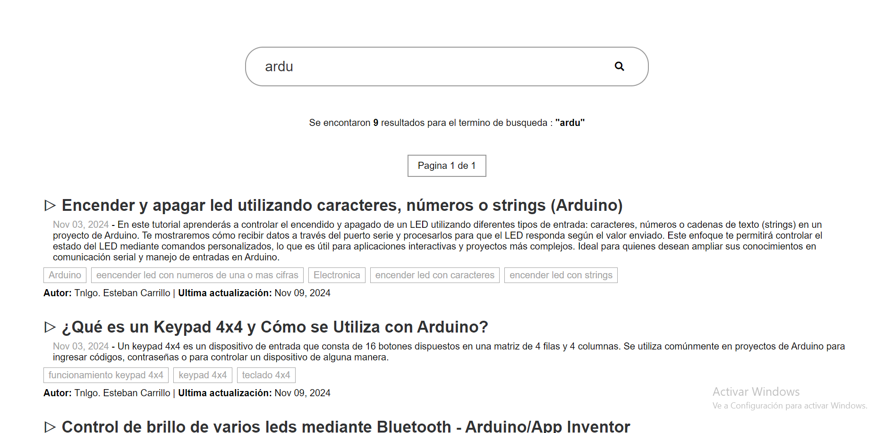
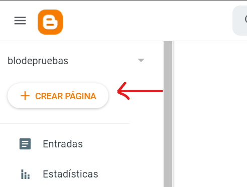
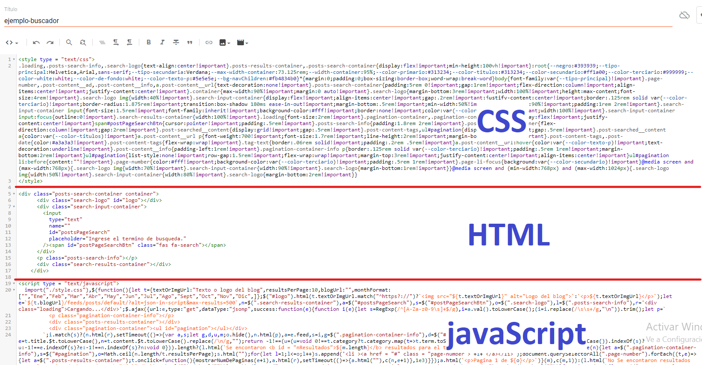
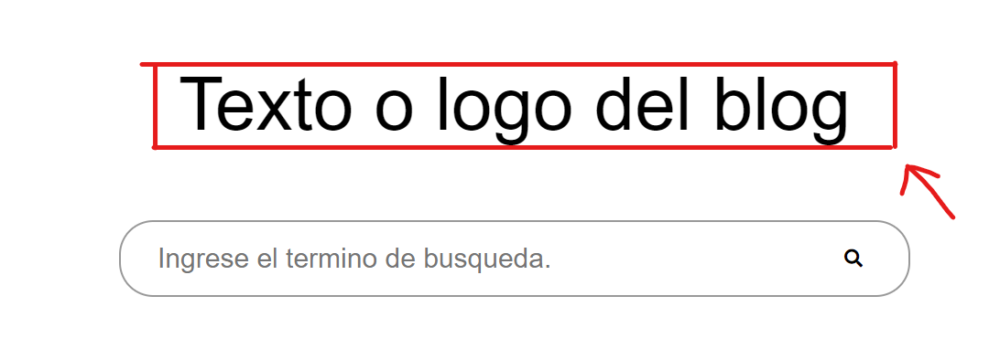
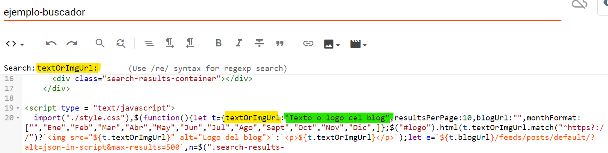
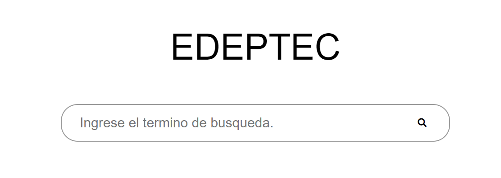
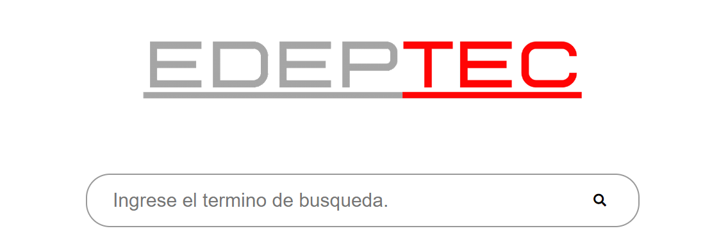
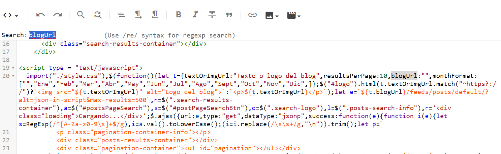

Motor de búsqueda para blogs de Blogger
=====================================

Previsualizacion:
-----------------



Pueden ver el codigo mejor documentado y estructurado [aqui](https://github.com/EstebanCarrilloG/blogger-blog-search-engine/tree/2024-update)

Descripción:
------------

Este buscador se utiliza para encontrar publicaciones de nuestro blog de Blogger, relacionadas con el término de búsqueda introducido. Podemos utilizarlo dentro del blog de Blogger o en una página web externa.

Tecnologías utilizada:
----------------------

*   HTML
*   CSS
*   JavaScript - jQuery
*   Webpack

Como usarlo:
------------

1.  Crea una nueva página en tu blog de blogger. 

2.  Pega los siguientes códigos en tu pagina de blogger.
* Codigo CSS:
Código obtenido del archivo [style.min.css](./src/style.min.css).
```html
<style type = "text/css">
.loading,.posts-search-info,.search-logo{text-align:center!important}.posts-results-container,.posts-search-container{display:flex!important;min-height:100vh!important}:root{--negro:#393939;--tipo-principal:Helvetica,Arial,sans-serif;--tipo-secundaria:Verdana;--max-width-container:73.125rem;--width-container:95%;--color-primario:#313234;--color-titulos:#313234;--color-secundario:#ff1a00;--color-terciario:#999999;--color-white:white;--color-de-fondo:white;--color-texto-p:#5e5e5e;--bg-navChildren:#fb4834b0}*{margin:0;padding:0;box-sizing:border-box;word-wrap:break-word}body{font-family:var(--tipo-principal)!important}.page-number,.post-content__ad,.post-content__info,a.post-content__url{text-decoration:none!important}.posts-search-container{padding:5rem 0!important;gap:1rem!important;flex-direction:column!important;align-items:center!important;justify-content:center!important}.container{max-width:90%!important;margin:0 auto!important}.search-logo{margin-bottom:3rem!important;width:100%!important;height:max-content;font-size:4rem!important}.search-logo img{width:40%!important}.search-input-container{display:flex!important;align-items:center!important;gap:.2rem!important;justify-content:center!important;border:.125rem solid var(--color-terciario)!important;border-radius:1.875rem!important;transition:box-shadow 180ms ease-in-out!important;margin-bottom:.5rem!important;min-width:50%!important;max-width:90%!important;padding:1rem 2rem!important}.search-input-container input{font-size:1.5rem!important;font-family:inherit!important;background-color:#fff!important;border:none!important;color:var(--color-primario)!important;width:100%!important}.search-input-container input:focus{outline:0!important}.search-results-container{width:100%!important}.loading{font-size:2rem!important}.pagination-container,.pagination-container-info{display:flex!important;justify-content:center!important}span#postPageSearchBtn{cursor:pointer!important;padding:.5rem!important}.posts-search-info{padding:1.8rem 2rem!important}.posts-results-container{flex-direction:column!important;gap:2rem!important}.post-searched__content{display:grid!important;gap:.5rem!important}.post-content-tags,ul#pagination{display:flex!important;gap:.5rem!important}.post-searched__content a{color:var(--color-titulos)!important}a.post-content__url p{font-weight:700!important;font-size:1.7rem!important;line-height:2rem!important;margin-bottom:initial!important}.post-content-tags,.post-date{color:#a3a3a3!important}.post-content-tags{flex-wrap:wrap!important}.tag-text{border:.06rem solid!important;padding:.2rem .5rem!important}a.post-content__url:hover{color:var(--color-texto-p)!important;text-decoration:underline!important}.post-content__info{padding-left:1rem!important}.pagination-container-info p{border:.125rem solid var(--color-terciario)!important;padding:.5rem 1rem!important;margin-bottom:2rem!important}ul#pagination{list-style:none!important;row-gap:1.5rem!important;flex-wrap:wrap!important;margin-top:3rem!important;justify-content:center!important;align-items:center!important}ul#pagination li:before{content:""!important}.page-number{color:#fff!important;background-color:var(--color-terciario)!important;padding:.5rem 1rem!important}.page-li-focus{background:var(--color-secundario)!important}@media screen and (max-width:768px){.search-logo img{width:70%!important}.search-input-container{width:90%!important}.search-logo{margin-bottom:1rem!important}}@media screen and (min-width:768px) and (max-width:1024px){.search-logo img{width:50%!important}.search-input-container{width:80%!important}.search-logo{margin-bottom:2rem!important}}
</style>
```
* Código HTML:
Código obtenido del archivo [index.html](./src/index.html).
```html
<div class="posts-search-container container">
  <div class="search-logo" id="logo"></div>
  <div class="search-input-container">
    <input
      type="text"
      name=""
      id="postsPageSearch"
      placeholder="Ingrese el termino de busqueda."
    /><span id="postPageSearchBtn" class="fas fa-search"></span>
  </div>
  <p class="posts-search-info"></p>
  <div class="search-results-container"></div>
</div>
```
* Código JavaScript:
Código obtenido del archivo [index.min.js](./src/index.min.js).
```html
<script type = "text/javascript">
  $(function(){let t={textOrImgUrl:"Texto o logo del blog",resultsPerPage:10,blogUrl:"",monthFormat:["","Ene","Feb","Mar","Abr","May","Jun","Jul","Ago","Sept","Oct","Nov","Dic",]};$("#logo").html(t.textOrImgUrl.match("^https?://")?``:`<p>${t.textOrImgUrl}</p>`);let e=`${t.blogUrl}/feeds/posts/default/?alt=json-in-script&max-results=500`,n=$(".search-results-container"),a=$("#postsPageSearch"),s=$("#postPageSearchBtn"),o=$(".search-logo"),l=$(".posts-search-info"),r='<div class="loading">Cargando...</div>';$.ajax({url:e,type:"get",dataType:"jsonp",success:function(e){function i(e){let s=RegExp(/^[A-Za-z0-9\s]+$/g),i=a.val().toLowerCase();(i=i.replace(/\s\s+/g,"\n")).trim();let p=` 
          <p class="pagination-container-info"></p>
          <div class="posts-results-container"></div>
          <div class="pagination-container"><ul id="pagination"></ul></div>
        `;i.match(s)?(n.html(r),setTimeout(()=>{var a,s;let g,d,u,m;o.hide(),n.html(p),a=e.feed,s=i,g=$(".pagination-container-info"),d=$("#pagination"),u=[],(m=a.entry.filter(t=>{let e=t.title.$t.toLowerCase(),n=t.content.$t.toLowerCase().replace(/\n/g,"");return -1!==(u=(u=void 0!==t.category?t.category.map(t=>t.term.toString()):["No tags found"]).toString().toLowerCase()).indexOf(s)?u:-1!==e.indexOf(s)?e:-1!==n.indexOf(s)?n:void 0})).length?(l.html(`Se encontaron <b id = "nResultados">${m.length}</b> resultados para el termino de busqueda : <b>"${s}"</b>`),function e(n){let a=$(".pagination-container-info"),s=$("#pagination"),o=Math.ceil(n.length/t.resultsPerPage);s.html("");for(let l=1;l<=o;l++)s.append('<li ><a href = "#" class = "page-number">'+l+"</a></li>");document.querySelectorAll(".page-number").forEach((t,e)=>{let a=$(".posts-results-container");t.onclick=function(){pagesInfo(e+1),a.html(r),setTimeout(()=>{a.html(""),c(n,e+1)},1e3)}});a.html(`<p>Pagina 1 de ${o}</p>`)}(m),c(m,1)):(l.html(`No Se encontaron resultados para el termino de busqueda : <b>"${s}"</b>`),g.html(""),d.html(""))},1e3)):(l.text("Error, No se admiten caracteres especiales como terminos de busqueda."),o.show(),n.html(""))}function c(e,n){let a=$(".posts-results-container"),s="",o="";e=e.slice((n-1)*t.resultsPerPage,n*t.resultsPerPage),$(".page-number").removeClass("page-li-focus");let l=$(".page-number")[n-1];$("#pagination li").find(l).addClass("page-li-focus"),e.map(e=>{let n=document.createElement("div");n.classList.add("post-searched__content");let l=$("<div>").html(e.content.$t);o=l.find("p.blog-post-description").text()?l.find("p.blog-post-description").text():"Descripcion del post";for(let r=0;r<e.link.length;r++)if("alternate"==e.link[r].rel){s=e.link[r].href;break}let i=e.published.$t,c=i.substring(0,4),p=i.substring(5,7),g=i.substring(8,10),d=t.monthFormat[parseInt(p,10)]+" "+g+", "+c,u=e.updated.$t,m=u.substring(0,4),h=u.substring(5,7),f=u.substring(8,10),b=t.monthFormat[parseInt(h,10)]+" "+f+", "+m,_=`
      <a target ="_blank" class = "post-content__url" href = "${s}"><p>${e.title.$t}</p></a>
        <p class="post-content__info">
                  <span class ="post-date" >${d}</span> - ${o}
                </p>
                <p class="post-content-tags">${void 0!==e.category?e.category.map(t=>`<span class= "tag-text">${t.term}</span>`).join(""):'<span class= "tag-text">No tags found</span>'}</p>
                <p class="post-content__ad">
                    <span><b>Autor:</b> ${e.author[0].name.$t}</span> |
                    <span><b>Ultima actualizacion:</b> ${b}</span>
              </p>
            `;return n.innerHTML=_,a.append(n),0})}a.keydown(function(t){13===t.keyCode&&i(e)}),s.click(function(){i(e)})},complete:function(){console.log("Done")}})});
</script>  
```
* Debe quedar así:


Para modificar el texto de la página inicial o cambiarlo por una imagen:
 

 buscamos la propiedad: <span style="color:orange; font-weight:bold">textOrImgUrl</span> y modificar su <span style="color:green; font-weight:bold">valor</span> el cual puede ser un texto o una imagen.


Ejemplo:
* Usando texto:
```javascript	
textOrImgUrl:"EDEPTEC"
```

* Usando imagen:
```javascript
textOrImgUrl:"https://www.example.com/example.png"
```


Aclaraciones:
----------------------
Como en estamos usando el buscador en blogger no es necesario modificar el valor de la propiedad blogUrl. 

Si vamos a utilizar el buscador en una pagina web diferente, si es necesario ingresar la url de nuestro blog en la propiedad blogUrl.


